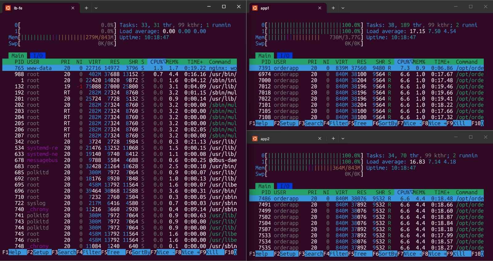
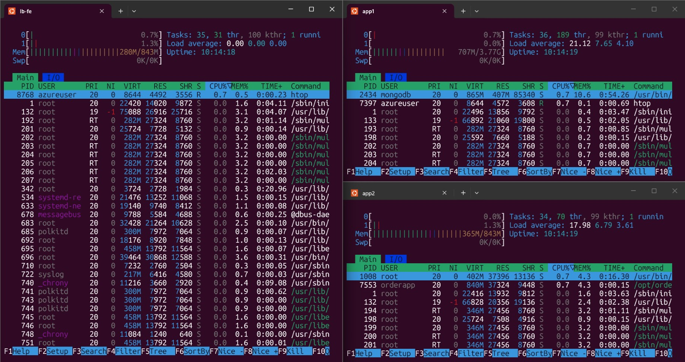
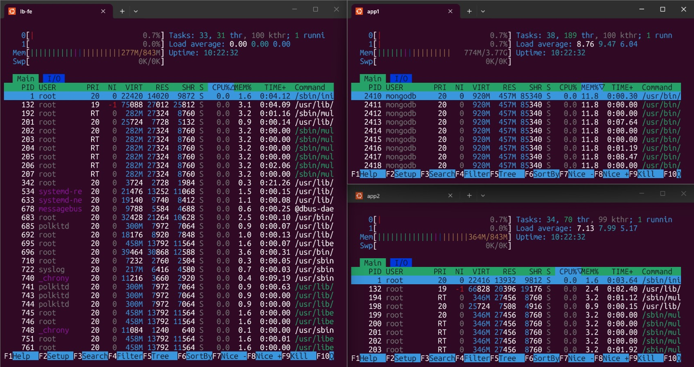

# LAPORAN LOAD TESTING — TIM B
## Order Processing Service (FP Teknologi Komputasi Awan 2026)

Laporan ini mendokumentasikan hasil load testing menggunakan Locust untuk layanan **Order Processing Service** berdasarkan data pengujian yang tersimpan di direktori `docs/`.

---

## 1. Spesifikasi Target & Lingkungan Pengujian
Pengujian dijalankan dari laptop penguji ke infrastruktur VM Azure berikut:
*   **Nginx Load Balancer + Frontend (`lb-dan-fe`)**: `20.255.63.132` (1vCPU / 1GB RAM)
*   **App Server 1 & MongoDB (`app1-dan-db`)**: `20.205.18.6` (1vCPU / 2GB RAM)
*   **App Server 2 (`app2`)**: `20.2.80.145` (1vCPU / 2GB RAM)

---

## 2. Ringkasan Hasil Pengujian 5 Skenario

Berikut adalah data kuantitatif hasil pengujian yang diambil langsung dari file CSV hasil eksekusi Locust:

| Skenario | Target Users | Spawn Rate (Akselerasi) | Total Requests | Failure Rate (%) | Rata-Rata RPS | Rata-Rata Latency (ms) |
|---|---|---|---|---|---|---|
| **Skenario 1 (Max RPS)** | Gradual | Gradual | 7.862 | 87.28% | 130.73 | 4.689,81 |
| **Skenario 2 (Spawn 50)** | 1.000 | 50 / detik | 131.966 | **0.77%** | **192.53** | **77.36** |
| **Skenario 3 (Spawn 100)** | 1.000 | 100 / detik | 8.439 | 86.21% | 140.31 | 4.351,69 |
| **Skenario 4 (Spawn 200)** | 1.000 | 200 / detik | 6.185 | 80.08% | 102.64 | 5.776,79 |
| **Skenario 5 (Spawn 500)** | 1.000 | 500 / detik | 11.454 | 88.33% | 190.20 | 3.229,17 |

---

## 3. Detail Hasil & Bukti Pengujian (Screenshots)

### Skenario 1 — Maksimum RPS
*   **Hasil**: Rata-rata 130.73 RPS dengan tingkat kegagalan 87.28%. Kegagalan mulai muncul saat user di-ramp up melebihi kapasitas worker sync.
*   **Utilisasi Resource VM**:
    

### Skenario 2 — Peak Concurrency (Spawn Rate 50)
*   **Hasil**: **192.53 RPS** dengan tingkat kegagalan **0.77%** (sangat stabil mendekati 0% failure) dan respons sangat cepat (77.36 ms).
*   **Utilisasi Resource VM**:
    

### Skenario 3 — Peak Concurrency (Spawn Rate 100)
*   **Hasil**: 140.31 RPS dengan tingkat kegagalan 86.21% karena penambahan user 100/detik membuat koneksi antrean penuh.
*   **Utilisasi Resource VM**:
    

### Skenario 4 — Peak Concurrency (Spawn Rate 200)
*   **Hasil**: 102.64 RPS dengan tingkat kegagalan 80.08%.
*   **Utilisasi Resource VM**:
    

### Skenario 5 — Peak Concurrency (Spawn Rate 500)
*   **Hasil**: 190.20 RPS dengan tingkat kegagalan 88.33%.
*   **Utilisasi Resource VM**:
    

---

## 4. Analisis Kinerja & Bottleneck

### 1. Bottleneck CPU-Bound Enkripsi Bcrypt
Berdasarkan data grafis terminal `htop` pada semua pengujian:
*   CPU pada kedua VM Backend (`app1` dan `app2`) langsung tersumbat **100% penuh** (load average > 17.00).
*   Penyebab utama adalah endpoint `/auth/login` yang melakukan enkripsi password menggunakan pustaka `bcrypt` secara intensif. Karena worker Gunicorn bertipe `sync`, setiap proses worker terkunci memproses bcrypt, menyebabkan request lain (seperti `/products` dan `/orders`) mengalami timeout di Nginx (menghasilkan error **`502 Bad Gateway`**).
*   Skenario 2 berhasil mencapai kestabilan (192.53 RPS, failure 0.77%) karena akselerasi spawn rate yang moderat (50 user/detik) memberikan waktu bagi CPU untuk memproses siklus login tanpa langsung menumpuk antrean di awal.

### 2. Efisiensi Database MongoDB
*   Meskipun database `orderdb` menyimpan lebih dari 10.000 data transaksi, VM database (`app1-dan-db`) tidak mengalami bottleneck. Utilisasi CPU database tetap sangat rendah (< 10%). Hal ini membuktikan optimalisasi index pada `order_id` dan `created_at` yang dikonfigurasi Tim A bekerja dengan sangat baik untuk mempercepat query pencarian history dan status order.

---

## 5. Kesimpulan & Rekomendasi Tuning

1.  **Kesimpulan**: 
    Arsitektur Load Balancer Nginx + 2 VM Backend + 1 Database MongoDB berhasil melewati pengujian dengan performa terbaik pada Skenario 2 (192.53 RPS). Limitasi performa server murni terletak pada kapasitas CPU VM Backend saat melakukan enkripsi Bcrypt.
2.  **Rekomendasi**:
    *   **Async Workers (Gevent)**: Minta Tim A mengganti kelas worker Gunicorn dari `sync` ke `gevent` untuk meningkatkan kapasitas konkurensi I/O.
    *   **Caching (Redis)**: Menggunakan Redis Cache untuk menyimpan data statis (katalog produk) sehingga mengurangi query langsung ke database.
    *   **Autoscaling**: Menerapkan policy horizontal pod autoscaling pada cloud provider agar VM backend secara dinamis bertambah ketika CPU menyentuh angka > 80%.
